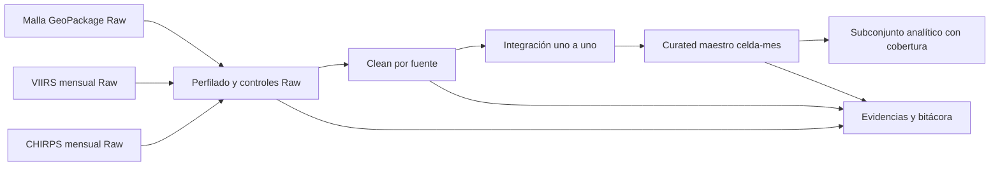

# Tarea ETL - FireForest

## Estado de esta etapa

Esta carpeta contiene las bases de organización, el alcance, el perfilado
inicial reproducible, la matriz de calidad y la capa Clean de la tarea ETL. Ya
se completaron el inventario de fuentes, la verificación de hashes, el
diagnóstico por columna, la validación de claves y relaciones, el diagnóstico
de valores atípicos, la bitácora de decisiones y la limpieza separada de malla,
VIIRS y CHIRPS.

Las capas Clean y Curated están materializadas en CSV y Parquet. Curated
integra VIIRS y CHIRPS en 95.964 observaciones celda-mes y cuenta con un
diccionario de 45 variables. No se realizan cargas en PostgreSQL o MongoDB.

La guía académica de referencia es
`Guia_Tarea_ETL_Calidad_Integracion_1_5_puntos.pdf`.

## Objetivo

Construir un flujo ETL reproducible que integre la malla
espacial de FireForest, la evidencia mensual de incendios VIIRS y las métricas
mensuales de precipitación CHIRPS, para obtener un dataset analítico confiable
por celda espacial y mes.

El flujo deberá conservar los datos originales, producir capas Raw, Clean y
Curated, documentar todas las decisiones de calidad y demostrar sus resultados
mediante controles automatizados.

## Pregunta analítica

¿Qué relación existe entre la precipitación mensual y la
ocurrencia/intensidad de incendios en las celdas espaciales del cantón Loja
durante 2023?

## Alcance definido

| Elemento | Definición |
|---|---|
| Área de estudio | Cantón Loja |
| Periodo | Enero a diciembre de 2023 |
| Población | Celdas de 500 m x 500 m que intersectan el cantón Loja |
| Unidad de análisis final | Una celda espacial observada durante un mes |
| Clave técnica de integración | `cell_index + anio + mes` |
| Clave analítica final | `cell_id + anio + mes` |
| Fuentes | Malla espacial, VIIRS mensual y CHIRPS mensual |
| Filas esperadas antes de reglas de calidad | 95.964 celda-meses (7.997 celdas x 12 meses) |
| Formatos de salida previstos | CSV y Parquet |

## Fuentes de entrada

Los archivos originales se mantienen fuera de esta carpeta, en
`../02_datos/raw/`. No deben copiarse nuevamente ni modificarse para ejecutar
esta tarea.

| Fuente | Ruta relativa al Proyecto Integrador | Grano disponible | Uso previsto |
|---|---|---|---|
| Malla | `../02_datos/raw/malla/malla_500m_loja_maestra.gpkg` | Una fila por celda | Obtener `cell_id`, atributos espaciales y correspondencia con `cell_index` |
| VIIRS | `../02_datos/raw/viirs/viirs_evidencia_500m_celda_mes_2019_2025_v1_0_3.csv` | Celda-mes | Métricas mensuales de ocurrencia e intensidad de fuego |
| CHIRPS | `../02_datos/raw/chirps/chirps_500m_celda_mes_2019_2025.csv` | Celda-mes | Métricas mensuales de precipitación |

La procedencia, el tamaño y los hashes SHA-256 están registrados en
`../05_ingesta/metadatos/manifiesto_firelab_loja.json`.

## Decisiones metodológicas iniciales

1. Los archivos VIIRS y CHIRPS disponibles ya están agregados a nivel
   celda-mes. Esta tarea no los presentará como observaciones diarias ni como
   detecciones individuales.
2. `cell_index` será la clave técnica para enlazar VIIRS con la malla. El
   `cell_id` obtenido de la malla será el identificador espacial publicado en
   el dataset final.
3. La integración deberá validar una cardinalidad uno a uno por
   `cell_index + anio + mes`.
4. Los datos Raw nunca se sobrescribirán. Toda corrección generará una nueva
   salida en Clean o Curated.
5. Un valor VIIRS faltante no se convertirá automáticamente en cero. Se
   conservará como nulo y se acompañará de una bandera de calidad, porque falta
   de observación no equivale a ausencia de incendio.
6. Las celdas fronterizas o con cobertura insuficiente se conservarán durante
   el perfilado y la limpieza. Cualquier exclusión del dataset analítico deberá
   registrarse y justificarse en la bitácora de decisiones.
7. Las comparaciones de coberturas y fracciones usarán una tolerancia numérica
   documentada; no se dependerá de igualdad exacta de números decimales.
8. La ejecución futura será determinística e idempotente: dos ejecuciones con
   las mismas entradas deberán producir resultados analíticos equivalentes y
   no duplicar registros.

## Capas del flujo

### Raw

Corresponde a los archivos originales conservados en `../02_datos/raw/`. Esta
carpeta solo documentará sus rutas, hashes, formatos y forma reproducible de
acceso.

### Clean

Contiene datos tipados y estandarizados de cada fuente por separado, además de
excepciones VIIRS sin cobertura y una estructura explícita para rechazos
críticos. Conserva 7.997 celdas y 95.964 filas mensuales por fuente.

### Curated

Contiene el dataset integrado con una fila por `cell_id + anio + mes` y su
diccionario de datos. El maestro conserva las 95.964 filas; para análisis
conjunto se seleccionan las 95.064 filas con `apto_analisis=true`.

## Diagrama del flujo



## Transformaciones implementadas en Clean

Además de la integración que se realizará en Curated, Clean implementa seis
transformaciones documentadas en `configuracion/transformaciones_clean.json`:

1. Selección reproducible de 2023 sin modificar Raw.
2. Tipado de identificadores, números, fechas y booleanos.
3. Construcción y validación de `periodo` y `anio_mes`.
4. Incorporación de `cell_id` y atributos territoriales mediante la malla.
5. Construcción de indicadores de cobertura, aptitud y fracción de días húmedos.
6. Marcado IQR de valores atípicos sin eliminarlos ni reemplazarlos.

## Controles de calidad previstos

El flujo deberá incluir como mínimo seis verificaciones ejecutables. La base de
trabajo contempla las siguientes:

1. Unicidad y ausencia de nulos en la clave final.
2. Cardinalidad uno a uno durante las integraciones.
3. Reconciliación de filas antes y después de cada etapa.
4. Completitud de las variables críticas.
5. Validez de tipos, rangos, porcentajes y fracciones.
6. Consistencia entre `anio`, `mes` y `anio_mes`.
7. Correspondencia única entre `cell_index` y `cell_id`.
8. Consistencia entre días húmedos, secos, válidos y calendario.
9. Verificación del CRS esperado de la malla: EPSG:32717.
10. Equivalencia de resultados al ejecutar el flujo dos veces.

Cada control deberá registrar la regla, el resultado, la cantidad de
incumplimientos y la acción aplicada.

## Estructura de trabajo

```text
tarea_ETL/
|-- README.md
|-- Guia_Tarea_ETL_Calidad_Integracion_1_5_puntos.pdf
|-- codigo/          # Scripts o notebook del flujo reproducible
|-- configuracion/   # Parámetros de periodo, rutas, tolerancias y reglas
|-- raw/             # Documentación de entradas; no duplica los originales
|-- clean/           # Salidas limpias, excepciones y rechazos
|-- curated/         # Dataset integrado y diccionario de datos
`-- evidencias/      # Perfilado, matriz de calidad, bitácora y resultados
```

## Fuera del alcance de la etapa Clean

- Cargar datos en PostgreSQL o MongoDB.
- Modificar los archivos de `../02_datos/raw/`.
- Ejecutar Airflow, Spark o PySpark.
- Eliminar registros o valores atípicos silenciosamente.

## Ejecución del perfilado inicial

Desde la raíz de FireForest:

```powershell
.venv\Scripts\python.exe Tareas\Proyecto_integrador\tarea_ETL\codigo\perfilar_fuentes.py
```

El script verifica los hashes, recorre las tres fuentes y reemplaza de forma
determinística las evidencias de perfilado. Se ejecutó dos veces sobre las
mismas entradas y los hashes de todas sus salidas fueron idénticos.

## Ejecución de controles Raw

Después del perfilado:

```powershell
.venv\Scripts\python.exe Tareas\Proyecto_integrador\tarea_ETL\codigo\evaluar_calidad_raw.py
```

Este script genera la matriz de calidad, el diagnóstico IQR, la bitácora de
decisiones, la matriz de entregables y la lista de verificación de la guía. De
14 reglas evaluadas, 11 cumplen y 3 corresponden a observaciones con tratamiento
definido; no existen reglas Raw incumplidas.

El seguimiento completo de los entregables se mantiene en
`evidencias/matriz_entregables_guia.csv` y
`evidencias/lista_verificacion_guia.md`.

## Ejecución de Clean y Curated

Después de los controles Raw:

```powershell
.venv\Scripts\python.exe Tareas\Proyecto_integrador\tarea_ETL\codigo\etl_fireforest.py
```

El script publica malla, VIIRS y CHIRPS por separado en Clean y construye el
Curated maestro mediante una unión uno a uno. Conserva las 95.964 claves,
mantiene como nulas las 900 filas sin observación VIIRS y añade banderas de
cobertura y valores atípicos. Cumplen 16 controles Clean y 11 controles
Curated.

## Ejecución completa desde cero

El profesor puede reproducir perfilado, calidad Raw, Clean, Curated y el
seguimiento de entregables con un solo comando desde la raíz de FireForest:

```powershell
.venv\Scripts\python.exe Tareas\Proyecto_integrador\tarea_ETL\codigo\etl_fireforest.py --desde-cero
```

Las dependencias externas verificadas están fijadas en
`configuracion/requirements_etl.txt`. El proceso reemplaza sus productos de
forma atómica y no anexa registros de ejecuciones anteriores.

## Conclusiones y limitaciones

### Conclusiones

1. La integración uno a uno conserva exactamente 95.964 claves
   `cell_id + anio + mes`; no genera duplicados ni claves huérfanas.
2. Existen 95.064 filas aptas para análisis conjunto y 900 filas sin
   observación VIIRS. Estas últimas permanecen en el maestro como nulas y no se
   interpretan como ausencia de incendio.
3. Se conservan 747 celda-meses con evidencia de fuego y 709 con evidencia
   nominal o alta.
4. Los valores extremos de FRP y precipitación se marcan para revisión, pero no
   se eliminan porque pueden representar eventos ambientales reales.

### Limitaciones

1. VIIRS y CHIRPS ya llegan agregados por mes. El dataset no permite reconstruir
   detecciones o condiciones diarias individuales.
2. Las 900 observaciones VIIRS faltantes afectan 75 celdas fronterizas; cualquier
   análisis que filtre `apto_analisis=true` debe declarar esa reducción de
   cobertura espacial.
3. La tarea construye una base confiable para estudiar asociación entre lluvia
   y fuego, pero no estima causalidad ni sustituye un análisis estadístico.
4. Curated contiene atributos espaciales, pero la geometría permanece en el
   GeoPackage Raw para evitar duplicación y conservar una fuente espacial única.
5. La carga en PostgreSQL o MongoDB no forma parte de esta entrega ETL.

## Siguiente paso

Ejecutar dos veces el comando `--desde-cero`, comparar los productos finales y
preparar un paquete de entrega reducido. El paquete docente no incluirá cada
archivo auxiliar de trabajo; incluirá únicamente código, configuración,
instrucciones, Curated, diccionario y evidencias consolidadas exigidas.
