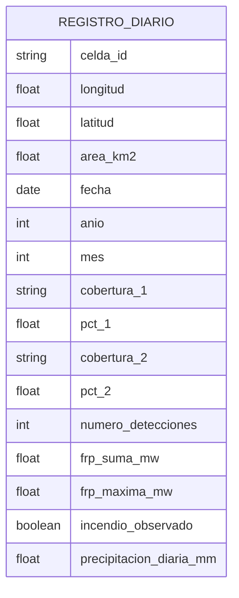
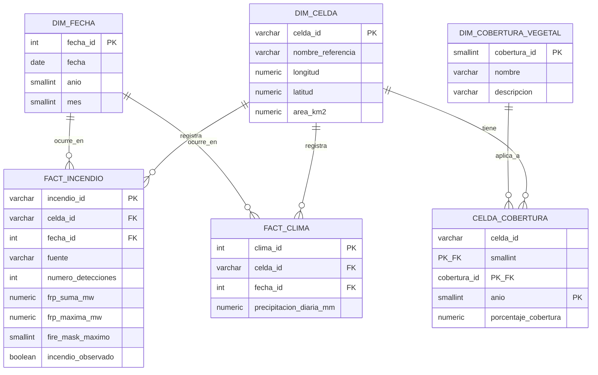

# Modelo relacional — Taller SQL (Práctica 2, M1721)

## Modelo inicial (desnormalizado)

Representación de la información tal como se recibiría inicialmente, en una sola entidad plana,
antes de aplicar 1FN/2FN/3FN (ver `normalizacion.md`).

## Modelo final (normalizado)

| Tabla | Propósito | PK | FK | Restricciones principales | Cardinalidad |
|---|---|---|---|---|---|
| `dim_celda` | Celda espacial de referencia (500 m × 500 m) | `celda_id` | — | `UNIQUE(longitud, latitud)`; `area_km2 > 0` | 1 celda — N detecciones, N registros de clima, N filas de cobertura |
| `dim_fecha` | Calendario diario del periodo de estudio | `fecha_id` | — | `fecha` `UNIQUE NOT NULL`; `mes` `CHECK 1–12`; `fecha_id` atado a `fecha` por `CHECK` | 1 fecha — N detecciones, N registros de clima |
| `dim_cobertura_vegetal` | Catálogo de tipos de cobertura del suelo | `cobertura_id` | — | `nombre` `UNIQUE NOT NULL` | 1 cobertura — N filas en `celda_cobertura` |
| `celda_cobertura` | Relación N:M celda↔cobertura por año | `(celda_id, cobertura_id, anio)` | `celda_id` → `dim_celda`; `cobertura_id` → `dim_cobertura_vegetal` | `porcentaje_cobertura` `CHECK (0, 100]` | N:M entre `dim_celda` y `dim_cobertura_vegetal` |
| `fact_incendio` | Registro diario de detección de incendio por celda | `incendio_id` | `celda_id` → `dim_celda`; `fecha_id` → `dim_fecha` | `UNIQUE(celda_id, fecha_id)`; `CHECK` coherencia observado/detecciones; `CHECK` FRP ≥ 0 | N incendios — 1 celda; N incendios — 1 fecha |
| `fact_clima` | Registro diario de precipitación por celda | `clima_id` | `celda_id` → `dim_celda`; `fecha_id` → `dim_fecha` | `UNIQUE(celda_id, fecha_id)`; `precipitacion_diaria_mm >= 0` | N registros — 1 celda; N registros — 1 fecha |

## Notas de auditoría del esquema

- Se partió conceptualmente de `dim_celda`, `dim_fecha`, `fact_incendio`, `fact_clima` del
  Proyecto Integrador FireForest, pero **no se copiaron tal cual**: se añadieron
  `dim_cobertura_vegetal` y `celda_cobertura` para cumplir el requisito de relación N:M de la
  guía (inexistente en el esquema original), y se retiró el tipo `GEOMETRY`/PostGIS de
  `dim_celda` porque este taller es estrictamente relacional y no requiere capacidades
  geoespaciales.
- Todas las tablas de hechos (`fact_incendio`, `fact_clima`) usan PK surrogate en lugar de clave
  compuesta natural, resguardando la integridad con `UNIQUE(celda_id, fecha_id)` (ver
  justificación de 2FN en `normalizacion.md`).
